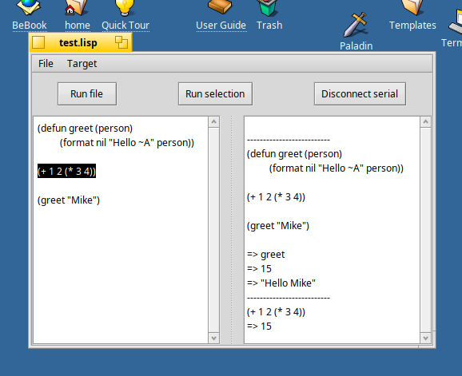

# Disclaimer

The repo is used for "working in public".
The project itself is not yet usable, but feel free to browse the oft-changing code.

I will remove this disclaimer when the GUI MVP milestone (see `scratchpad.md`) is done.

# What

Super-Tyson (ST) is a micro-ide for [micro lisp](http://www.ulisp.com/).



# Why

Needed a project to learn me some C++.
Also ulisp is lacking a small IDE, something like micropython's [Thonny](https://thonny.org/).

# How (to use)

``` sh
# configure
cmake -GNinja -Bbuild -S.

# build
ninja -C build

# run
./build/SuperTyson
```

